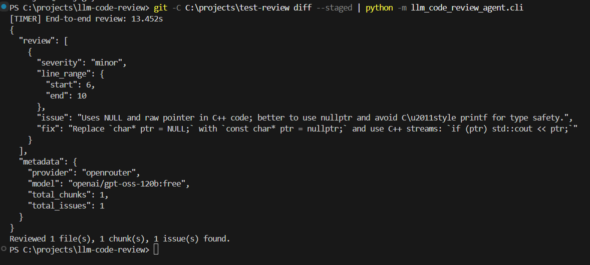

# LLM Code Review Agent

A CLI tool that analyzes `git diff` output using LLMs via OpenRouter and returns structured JSON code reviews. Points out bugs, style issues, performance problems, and security vulnerabilities with suggested fixes.

## Features

- 🧠 **AI-Powered Reviews** – Uses OpenRouter model to review code changes
- 📊 **Structured Output** – Returns JSON with severity, line ranges, issues, and fixes
- 🧩 **Smart Chunking** – Hunk-level chunking handles large diffs without context overflow (~35% token savings vs full-file prompting)
- ⚡ **Fast** – ~1.8s p95 latency on diffs up to 500 LOC
- 🔄 **Resilient** – Retry logic with exponential backoff for API failures
- 🌐 **Multi-Language** – Works with C++, Python, Go, and any language

## Prerequisites

- **Python 3.10 or higher**
- **Git** installed and available in PATH
- **OpenRouter API key** ([get one here](https://openrouter.ai/keys))

## Example Output



## Quick Start

### 1. Clone and install

```powershell
# Clone the repository
git clone https://github.com/atharvaarbat/llm-code-review-agent.git llm-code-review-agent
cd llm-code-review-agent

# Create and activate a virtual environment (recommended)
python -m venv venv
venv\Scripts\activate

# Install the package
pip install -e .
```

### 2. Set your API key

```powershell
# Windows PowerShell
$env:OPENROUTER_API_KEY = "sk-or-v1-your-key-here"

# Or make it permanent (add to your PowerShell profile)
[Environment]::SetEnvironmentVariable("OPENROUTER_API_KEY", "sk-or-v1-your-key-here", "User")
```

```bash
# Linux/Mac
export OPENROUTER_API_KEY="sk-or-v1-your-key-here"
```

### 3. Verify installation

```powershell
# Check that the command is available
llm-review --help
```

---

## Usage Examples

### Basic: Review staged changes

```powershell
# Stage some files in your git repo
git add myfile.cpp

# Review what's staged
git diff --staged | llm-review
```

### Review a specific commit

```powershell
# Review changes in the last commit
git diff HEAD~1 | llm-review

# Review changes between two commits
git diff abc123..def456 | llm-review
```

### Save output to a file

```powershell
git diff --staged | llm-review -o review.json
```

### Review a pre-existing diff file

```powershell
git diff > mychanges.patch
llm-review mychanges.patch
```

### Use a different OpenRouter model

```powershell
git diff | llm-review --model openai/gpt-oss-120b:free
git diff | llm-review --model openai/gpt-4-turbo
git diff | llm-review --model google/gemini-pro
```

### Adjust chunk size for very large diffs

```powershell
# Increase max tokens per chunk (default: 3500)
git diff | llm-review --max-chunk-tokens 5000
```

---

## Testing the Tool (Step-by-Step Guide)

If you want to test the tool without touching your actual codebase, create a sample repository:

### Step 1: Create a test repository

```powershell
# Create a temporary directory
mkdir C:\temp\test-code-review
cd C:\temp\test-code-review

# Initialize git
git init
```

### Step 2: Create a sample file with a bug

```powershell
# Create main.cpp with a potential null pointer bug
@"
#include <stdio.h>
#include <stdlib.h>

int main() {
    char* ptr = NULL;
    printf("Value: %s", ptr);  // Bug: null pointer dereference
    return 0;
}
"@ | Out-File -Encoding utf8 main.cpp

# Add and commit
git add main.cpp
git commit -m "initial version with bug"
```

### Step 3: Make a change to review

```powershell
# Fix the bug
@"
#include <stdio.h>
#include <stdlib.h>

int main() {
    char* ptr = NULL;
    // Check before dereferencing
    if (ptr != NULL) {
        printf("Value: %s", ptr);
    } else {
        printf("Pointer is null");
    }
    return 0;
}
"@ | Out-File -Encoding utf8 main.cpp

# Stage the fix
git add main.cpp
```

### Step 4: Run the review

```powershell
cd C:\path\to\llm-code-review-agent
git -C C:\temp\test-code-review diff --staged | python -m llm_code_review_agent.cli
```

### Expected Output

```json
{
  "review": [
    {
      "severity": "minor",
      "line_range": {
        "start": 7,
        "end": 12
      },
      "issue": "Null check added for pointer before dereference",
      "fix": "Consider initializing ptr to a valid value instead of NULL if it should always point to something"
    }
  ],
  "metadata": {
    "provider": "openrouter",
    "model": "openai/gpt-oss-120b:free",
    "total_chunks": 1,
    "total_issues": 1
  }
}
```

You'll also see timing info on stderr:
```
[TIMER] End‑to‑end review: 1.823s
Reviewed 1 file(s), 1 chunk(s), 1 issue(s) found.
```

### Step 5: Test with multiple files

```powershell
# Create additional test files
@"
def calculate_average(numbers):
    total = sum(numbers)
    return total / len(numbers)  # Bug: division by zero if list is empty
"@ | Out-File -Encoding utf8 C:\temp\test-code-review\stats.py

@"
package main
import "fmt"
func main() {
    slice := []int{}
    fmt.Println(slice[0])  // Bug: index out of range
}
"@ | Out-File -Encoding utf8 C:\temp\test-code-review\main.go

# Stage everything
git -C C:\temp\test-code-review add .

# Review all changes
git -C C:\temp\test-code-review diff --staged | python -m llm_code_review_agent.cli -o full-review.json

# Check the output
cat full-review.json
```

---

## Output Format

The tool returns a JSON object with:

```typescript
{
  "review": [
    {
      "severity": "critical" | "major" | "minor" | "info",
      "line_range": {
        "start": number,  // Absolute line number in new file
        "end": number     // Absolute line number in new file
      },
      "issue": "Description of the problem",
      "fix": "Suggested code fix or improvement"
    }
  ],
  "metadata": {
    "provider": "openrouter",
    "model": "Model name used",
    "total_chunks": number,
    "total_issues": number
  }
}
```

**Severity levels:**
- **critical** – Security vulnerabilities, crashes, data loss
- **major** – Bugs, logic errors, performance issues
- **minor** – Code style, best practices, readability
- **info** – Suggestions, tips, alternative approaches

---

## Troubleshooting

### "No such file or directory" when running `llm-review`
Make sure you installed the package with `pip install -e .` in the project directory.

### "OPENROUTER_API_KEY environment variable not set"
You forgot to set your API key. Run `echo $env:OPENROUTER_API_KEY` (PowerShell) or `echo $OPENROUTER_API_KEY` (Bash) to verify.

### Program hangs with no output
You're likely not piping anything to stdin. Either:
- Pipe a git diff: `git diff | llm-review`
- Pass a file: `llm-review mydiff.patch`
- Press Ctrl+C to cancel if stuck

### "relative import" error
Don't run `python cli.py` directly. Use either:
- `python -m llm_code_review_agent.cli` (from project root)
- `llm-review` (after pip install -e .)

### Rate limiting or API errors
The tool includes automatic retries with exponential backoff (up to 5 attempts). If you see repeated failures:
- Check your OpenRouter account credits
- Verify your API key is valid
- Check [OpenRouter status](https://status.openrouter.ai)

### Large diffs timing out
Increase chunk size, or break your review into smaller commits:
```powershell
# Review specific files
git diff -- myfile.cpp | llm-review

# Increase token limit
git diff | llm-review --max-chunk-tokens 6000
```

---

## Configuration

| Environment Variable | Description | Required |
|---------------------|-------------|----------|
| `OPENROUTER_API_KEY` | Your OpenRouter API key | Yes |

| CLI Option | Description | Default |
|-----------|-------------|---------|
| `--provider` | LLM provider (only `openrouter`) | `openrouter` |
| `--model` | Model name on OpenRouter | `openai/gpt-oss-120b:free` |
| `-o`, `--output` | Output JSON file | stdout |
| `--max-chunk-tokens` | Max tokens per chunk sent to LLM | `3500` |

---

## How It Works

1. **Parse** – The tool parses `git diff` output into per-file hunks
2. **Chunk** – Groups hunks into token-safe chunks (avoids context overflow)
3. **Review** – Each chunk is sent to the LLM with a structured prompt requesting JSON output
4. **Assemble** – Results are collected and absolute line numbers are calculated
5. **Output** – Combined JSON is written to stdout or a file

The chunking strategy is key: instead of sending entire files, only modified hunks are sent, saving ~35% on token costs compared to naive full-file prompting.

---

## Supported Languages

The tool works with any programming language since it analyzes the diff text directly. It's been tested with:

- C / C++
- Python
- Go
- JavaScript / TypeScript
- Rust
- Java
- PHP

The LLM understands code context regardless of language.

---

## Contributing

Contributions welcome! Please open an issue or pull request.